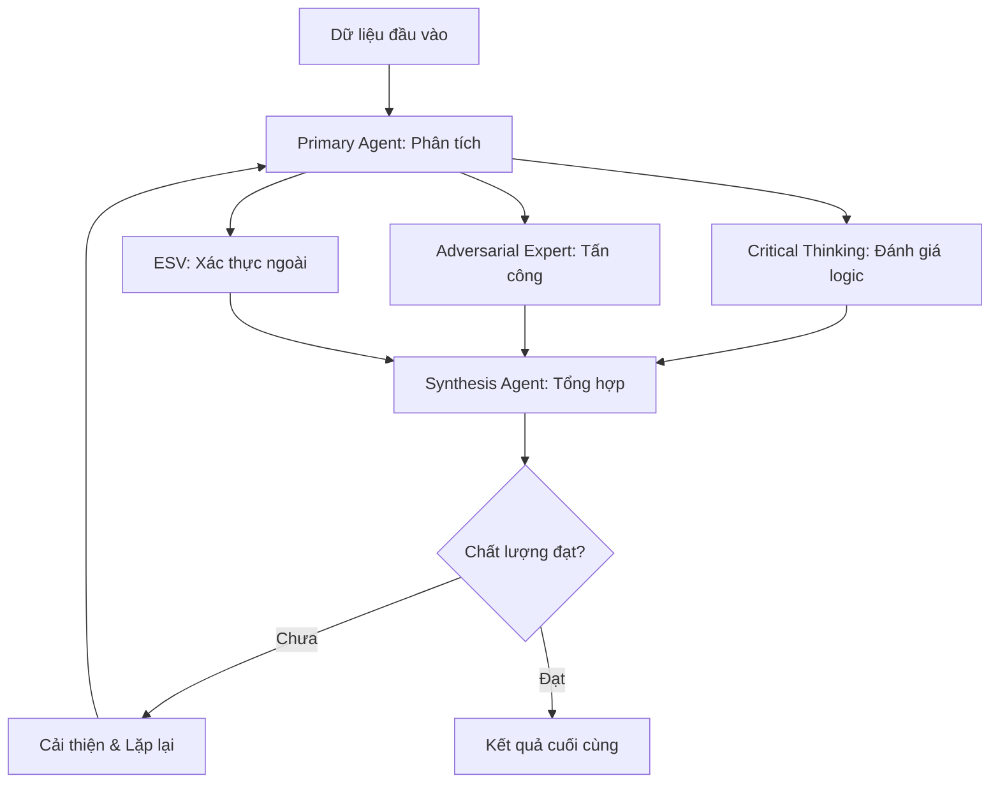

# 🧠 MCTS - Multi-Agent Critical Thinking System

**Hệ thống Tư duy Phản biện Tăng cường Đa Tác nhân**

Version 2.0 | Powered by Gemini 2.5 Pro

## 📋 Tổng quan

MCTS là một hệ thống LLM đa tác nhân tiên tiến, được thiết kế để tự động hóa quy trình phân tích dữ liệu và tạo ra các ý tưởng startup có chất lượng cao. Hệ thống sử dụng các tác nhân chuyên biệt để thực hiện tư duy phản biện sâu và đối kháng, đảm bảo kết quả cuối cùng không chỉ sáng tạo mà còn vững chắc và khả thi.

### 🎯 Mục tiêu chính

- **Tự động hóa phân tích** dữ liệu từ nhiều nguồn (Reddit, Hacker News, Product Hunt, etc.)
- **Tạo ra ý tưởng startup** có tính khả thi và tiềm năng thành công cao
- **Đảm bảo chất lượng** thông qua hệ thống tư duy phản biện và đối kháng
- **Xác thực thông tin** với thế giới thực qua module ESV
- **Tối ưu hóa quy trình** với vòng lặp tự tinh chỉnh

## 🏗️ Kiến trúc Hệ thống

### Các Tác nhân chính

1. **🎯 Primary LLM Agent**
   - Tác nhân thực thi chính
   - Phân tích dữ liệu và tạo ý tưởng
   - Tiếp nhận và xử lý phản hồi

2. **🧠 Critical Thinking Agent**
   - "Người gác cổng logic"
   - Đánh giá tính logic và nhất quán
   - Phát hiện lỗ hổng trong lập luận

3. **⚔️ Adversarial Expert Agent**
   - "Red Team" thử lửa ý tưởng
   - Đóng vai các chuyên gia đối kháng (VC, Engineer, Competitor)
   - Tấn công ý tưởng từ góc độ thực tế

4. **📊 Synthesis & Assessment Agent**
   - "Giám đốc dự án"
   - Tổng hợp kết quả từ tất cả agents
   - Đưa ra quyết định và điều phối quy trình

5. **🌐 ESV Module (External Search & Validation)**
   - Cầu nối với thế giới thực
   - Xác thực thông tin qua search engines
   - Kiểm tra competitors và market data

### Quy trình hoạt động



## 🚀 Cài đặt và Sử dụng

### Yêu cầu hệ thống

- Python 3.9+
- Access tới Gemini 2.5 Pro API (hoặc LLM tương thích)
- 8GB RAM khuyến nghị
- Internet connection (cho ESV module)

### Cài đặt

1. **Clone repository**
```bash
git clone https://github.com/lethanhson9901/MCTS.git
cd MCTS
```

2. **Tạo virtual environment**
```bash
python -m venv venv
source venv/bin/activate  # Linux/Mac
# hoặc
venv\Scripts\activate  # Windows
```

3. **Cài đặt dependencies**
```bash
pip install -r requirements.txt
```

4. **Cấu hình**
```bash
# Tạo file config mẫu
python main.py create-sample-config

# Copy và chỉnh sửa env file
cp env_example.txt .env
# Chỉnh sửa .env với thông tin API của bạn
```

### Sử dụng cơ bản

#### 🚀 **Mode Dynamic (Khuyến nghị)**

1. **Quick Question - Hỏi nhanh**
```bash
python main.py quick "AI startup trends 2024?"
python main.py quick "Ý tưởng fintech cho Gen Z"
python main.py quick "So sánh market SaaS vs PaaS"
```

2. **Interactive Chat - Trò chuyện liên tục**
```bash
python main.py chat
# Sau đó chat trực tiếp:
# 💬 Bạn: Phân tích xu hướng AI trong startup 2024
# 🤖 MCTS: [Detailed analysis]
# 💬 Bạn: Tạo 3 ý tưởng startup từ analysis này
```

3. **Structured Ask - Câu hỏi có cấu trúc**
```bash
python main.py ask "Phân tích chi tiết thị trường SaaS productivity tools"
python main.py ask --config custom_config.json "Tạo business plan cho ý tưởng AI tutoring"
```

4. **Full Pipeline - Chạy toàn bộ quy trình**
```bash
# Pipeline cơ bản
python main.py pipeline "Phân tích thị trường fintech Việt Nam và tạo 3 ý tưởng cho Gen Z"

# Tùy chỉnh số vòng lặp
python main.py pipeline "AI startup trends 2024" \
  --analysis-loops 3 \
  --idea-loops 4

# Tắt ESV (External Search) để tăng tốc
python main.py pipeline "Ý tưởng SaaS productivity" \
  --analysis-loops 2 \
  --idea-loops 2 \
  --no-esv

# Tùy chỉnh thư mục output
python main.py pipeline "Blockchain gaming trends" \
  --analysis-loops 2 \
  --idea-loops 3 \
  -o custom_results/
```

#### 📁 **Mode Classic (File-based)**

1. **Kiểm tra kết nối**
```bash
python main.py test-connection
```

2. **Phân tích với file data**
```bash
python main.py analyze \
  -d your_data.json \
  -f "AI/ML" -f "SaaS" -f "Fintech"
```

3. **Xem kết quả**
```bash
python main.py show-results results/mcts_20241226_143022
```

## 📊 Hệ thống Điểm số

### Tiêu chí đánh giá Analysis

| Tiêu chí | Trọng số | Mô tả |
|----------|----------|-------|
| Tính Logic | 2.0 | Chuỗi suy luận hợp lý, tránh fallacy |
| Tính Toàn diện | 1.8 | Phạm vi phân tích đầy đủ |
| Tính Nhất quán | 1.5 | Thống nhất nội tại |
| Chất lượng Bằng chứng | 2.2 | Độ tin cậy của data |
| Độ Sâu | 1.5 | Chi tiết và hiểu biết context |

### Tiêu chí đánh giá Ideas

| Tiêu chí | Trọng số | Mô tả |
|----------|----------|-------|
| Tính Khả thi | 2.0 | Khả thi kỹ thuật và tài chính |
| Tiềm năng Thị trường | 2.5 | Market size và timing |
| Tính Sáng tạo | 1.5 | Độ độc đáo và innovation |
| Mô hình Kinh doanh | 2.0 | Revenue streams bền vững |
| Lợi thế Cạnh tranh | 1.8 | Differentiation mạnh |
| Rủi ro Kỹ thuật | 1.5 | Technical complexity và risks |
| Đầu tư Ban đầu | 1.2 | Capital requirements |

### Red Flag System

- **Ngưỡng Red Flag**: < 3.0/10 cho bất kỳ tiêu chí nào
- **Mức độ nghiêm trọng**: Critical, High, Medium, Low
- **Auto-mitigation**: Hệ thống tự động đề xuất cách khắc phục

## 🎛️ Cấu hình nâng cao

### File config.json

```json
{
  "llm": {
    "url": "http://localhost:8000/v1/chat/completions",
    "model": "gemini-2.5-pro",
    "api_key": "your-api-key",
    "max_tokens": 4000,
    "temperature": 0.7
  },
  "max_analysis_loops": 3,
  "max_idea_loops": 4,
  "quality_threshold": 9.0,
  "red_flag_threshold": 3.0,
  "adversarial_roles": ["VC", "Kỹ_sư", "Đối_thủ"],
  "enable_external_validation": true
}
```

### Tùy chỉnh trọng số

```json
{
  "weights": {
    "tinh_kha_thi": 2.5,
    "tiem_nang_thi_truong": 3.0,
    "tinh_sang_tao": 1.0
  }
}
```

### ESV Configuration

```bash
# Trong .env file
GOOGLE_API_KEY=your-google-api-key
GOOGLE_SEARCH_ENGINE_ID=your-search-engine-id
BING_API_KEY=your-bing-api-key
```

## 📝 Format dữ liệu đầu vào

### Data Source Format

```json
{
  "type": "reddit",
  "description": "Dữ liệu từ r/startups",
  "content": "Nội dung raw data...",
  "metadata": {
    "timeframe": "2024-01-01 to 2024-01-31",
    "source_url": "https://reddit.com/r/startups"
  }
}
```

### Supported Data Types

- **Reddit**: Community discussions và trends
- **Hacker News**: Tech discussions và innovations  
- **Product Hunt**: Product launches và market feedback
- **Custom**: Bất kỳ text data nào

## 🔧 Troubleshooting

### Lỗi thường gặp

1. **LLM Connection Failed**
   - Kiểm tra URL và API key
   - Đảm bảo service đang chạy
   - Check network connectivity

2. **Out of Memory**
   - Giảm max_tokens trong config
   - Reduce batch size cho ESV
   - Use smaller data sources

3. **Poor Quality Scores**
   - Tăng số vòng lặp (max_loops)
   - Adjust quality thresholds
   - Improve data source quality

4. **ESV Validation Fails**
   - Check API keys cho search engines
   - Verify internet connection
   - Reduce search timeout
   - **DuckDuckGo HTTP 202**: API server đang "warming up" hoặc rate-limited, hệ thống sẽ tự retry với backoff

5. **SA-LLM Scoring Warnings**
   - Warning "No quality scores found" là bình thường khi LLM không output bảng điểm
   - Hệ thống sẽ dùng default scores (5.0) và vẫn hoạt động tốt
   - Để cải thiện: tinh chỉnh prompt trong `prompts/synthesis_assessment_llm.txt`

### Debug Mode

```bash
python main.py analyze --verbose -d data.json -f "Tech"
```

### Logs

- Application logs: `mcts.log`
- Session results: `results/{session_id}/`
- Error details trong console output

## 🎯 Use Cases

### 1. **Dynamic Q&A Assistant**
- Trả lời bất kỳ câu hỏi startup/business nào
- Real-time analysis từ user input
- Natural language processing
- Context-aware conversations

### 2. **Instant Idea Generation**
- Tạo ý tưởng từ brief descriptions
- No pre-defined data required
- Adaptive focus areas
- Quick validation feedback

### 3. **On-demand Market Analysis**
- Analyze text data trực tiếp
- Extract insights từ user descriptions
- Competitive landscape assessment
- Technology trend evaluation

### 4. **Interactive Consulting**
- Continuous conversation flow
- Build context qua multiple turns
- Refine ideas based on feedback
- Strategic planning support

### 5. **Classic Deep Analysis**
- Comprehensive multi-source analysis
- Structured data processing
- Full MCTS pipeline execution
- Detailed reporting

## 🔮 Roadmap

### Version 2.1 (Planned)
- [ ] Web UI interface
- [ ] Database integration
- [ ] Advanced visualization
- [ ] Real-time data feeds

### Version 3.0 (Future)
- [ ] Multi-language support
- [ ] Industry-specific models
- [ ] Advanced ML scoring
- [ ] Collaborative features

## 🤝 Contributing

1. Fork repository
2. Create feature branch
3. Implement changes
4. Add tests
5. Submit pull request

### Development Setup

```bash
# Install development dependencies
pip install -r requirements-dev.txt

# Run tests
python -m pytest tests/

# Code formatting
black .
isort .
```

## 📄 License

MIT License - xem file LICENSE để biết chi tiết.

## 💬 Support

- **Issues**: [GitHub Issues](link-to-issues)
- **Discussions**: [GitHub Discussions](link-to-discussions)
- **Email**: support@mcts.ai

## 🙏 Acknowledgments

- Gemini 2.5 Pro team for excellent LLM capabilities
- Open source community for amazing tools
- Startup ecosystem for inspiration and feedback

---

**Built with ❤️ for the startup community**

*Tạo ra những ý tưởng startup không chỉ sáng tạo mà còn khả thi và thành công*
