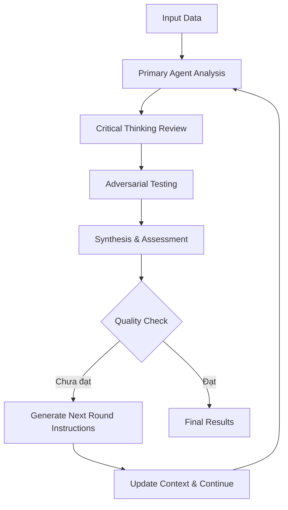
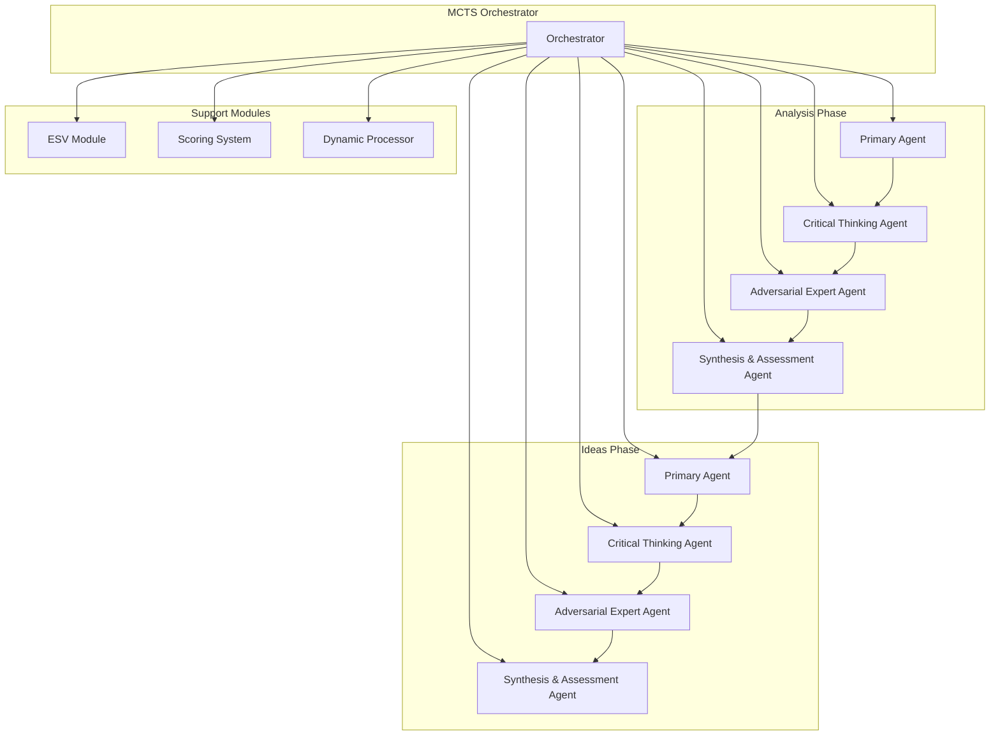
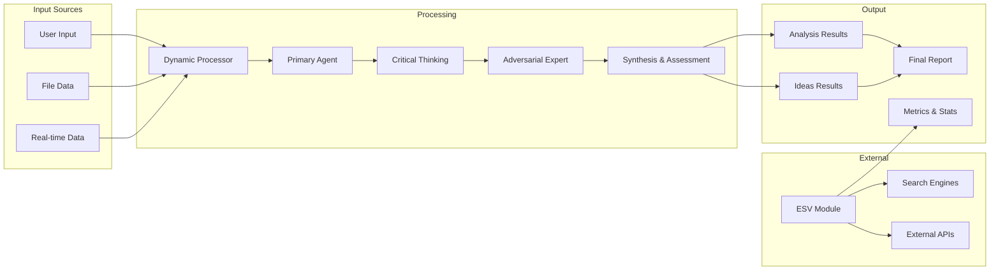
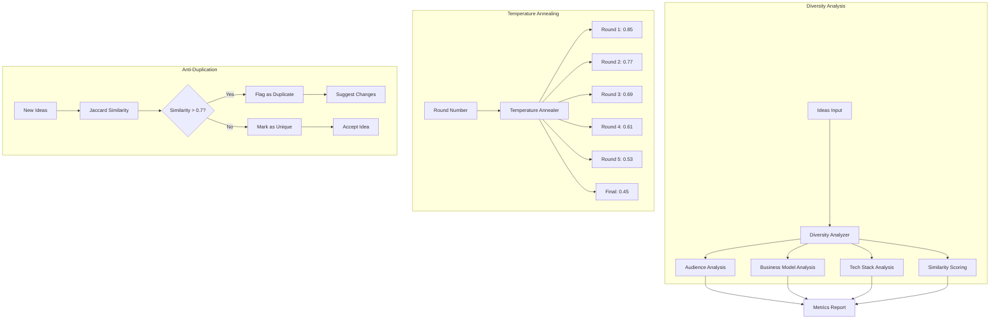
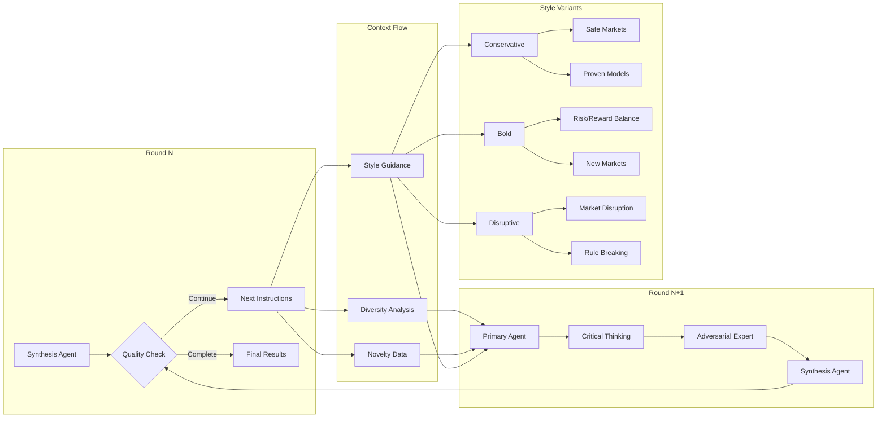
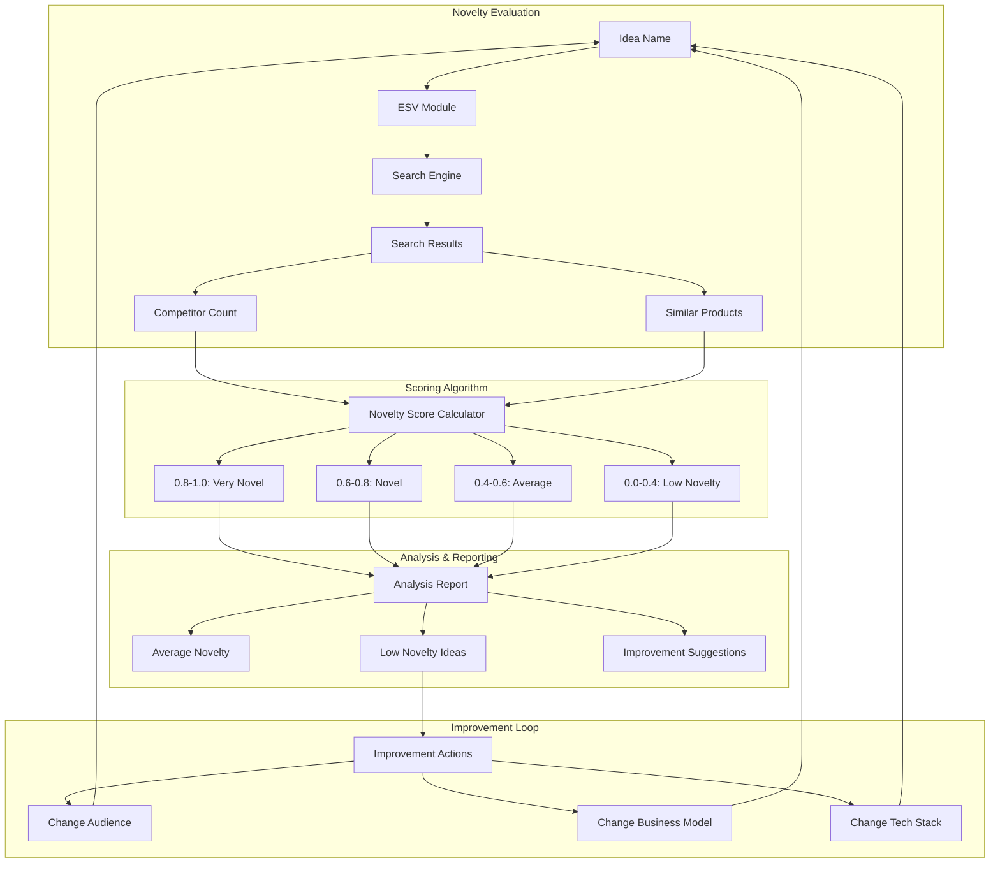
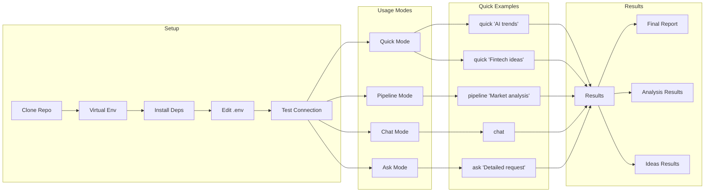
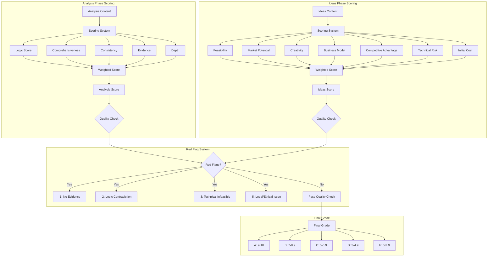

# 🧠 MCTS - Multi-Agent Critical Thinking System

**Hệ thống Tư duy Phản biện Tăng cường Đa Tác nhân**

[](https://python.org)
[](LICENSE)
[](CHANGELOG.md)

> **MCTS** là một hệ thống AI tiên tiến sử dụng kiến trúc đa tác nhân để tự động hóa quy trình phân tích dữ liệu và tạo ra các ý tưởng startup có chất lượng cao. Hệ thống kết hợp tư duy phản biện, đối kháng thông minh và xác thực thực tế để đảm bảo kết quả không chỉ sáng tạo mà còn khả thi và có tiềm năng thành công.

## 📋 Mục lục

- [🎯 Tổng quan](#-tổng-quan)
- [🏗️ Kiến trúc Hệ thống](#️-kiến-trúc-hệ-thống)
- [✨ Tính năng Chính](#-tính-năng-chính)
- [🚀 Cài đặt](#-cài-đặt)
- [📖 Hướng dẫn Sử dụng](#-hướng-dẫn-sử-dụng)
- [⚙️ Cấu hình](#️-cấu-hình)
- [📊 Hệ thống Đánh giá](#-hệ-thống-đánh-giá)
- [🔧 API Reference](#-api-reference)
- [🤝 Đóng góp](#-đóng-góp)
- [📄 License](#-license)

## 🎯 Tổng quan

### Mục tiêu

MCTS được thiết kế để giải quyết các thách thức trong quy trình brainstorming và phân tích ý tưởng startup:

- **🤖 Tự động hóa hoàn toàn** quy trình phân tích từ dữ liệu thô đến ý tưởng có thể thực thi
- **🧠 Tư duy phản biện sâu** thông qua hệ thống đa tác nhân chuyên biệt
- **⚔️ Thử lửa thực tế** với các chuyên gia đối kháng và xác thực thị trường
- **📈 Tối ưu hóa liên tục** thông qua vòng lặp tự cải thiện và học hỏi
- **🎯 Đảm bảo chất lượng** với hệ thống đánh giá đa chiều và tiêu chuẩn cao

### Ứng dụng

- **Startup Ideation**: Tạo ý tưởng startup từ xu hướng thị trường
- **Market Analysis**: Phân tích sâu thị trường và cơ hội kinh doanh
- **Competitive Intelligence**: Đánh giá đối thủ và lợi thế cạnh tranh
- **Product Strategy**: Phát triển chiến lược sản phẩm và go-to-market
- **Investment Research**: Hỗ trợ quyết định đầu tư với dữ liệu đa chiều

## 🏗️ Kiến trúc Hệ thống

### Tổng quan Kiến trúc

```
┌─────────────────────────────────────────────────────────────┐
│                    MCTS Orchestrator                        │
├─────────────────────────────────────────────────────────────┤
│  ┌─────────────┐  ┌─────────────┐  ┌─────────────┐         │
│  │   Primary   │  │  Critical   │  │ Adversarial │         │
│  │    Agent    │  │  Thinking   │  │    Expert   │         │
│  │             │  │   Agent     │  │    Agent    │         │
│  └─────────────┘  └─────────────┘  └─────────────┘         │
│                                                             │
│  ┌─────────────┐  ┌─────────────┐  ┌─────────────┐         │
│  │ Synthesis & │  │     ESV     │  │  Scoring    │         │
│  │ Assessment  │  │   Module    │  │  System     │         │
│  │   Agent     │  │             │  │             │         │
│  └─────────────┘  └─────────────┘  └─────────────┘         │
└─────────────────────────────────────────────────────────────┘
```

### Các Tác nhân Chính

#### 1. 🎯 Primary Agent
**Vai trò**: Tác nhân thực thi chính, phân tích dữ liệu và tạo ý tưởng

**Chức năng**:
- Phân tích dữ liệu từ nhiều nguồn (Reddit, HN, Product Hunt, etc.)
- Tạo ý tưởng startup với mô hình kinh doanh chi tiết
- Phát triển chiến lược go-to-market và roadmap
- Điều chỉnh phong cách sáng tạo theo vòng lặp

**Đặc điểm**:
- Adaptive temperature annealing cho đa dạng hóa
- Style variants: conservative, bold, disruptive
- Anti-duplication logic với Jaccard similarity

#### 2. 🧠 Critical Thinking Agent
**Vai trò**: "Người gác cổng logic", đảm bảo tính nhất quán và logic

**Chức năng**:
- Đánh giá tính logic và nhất quán của lập luận
- Phát hiện lỗ hổng trong phân tích
- Kiểm tra tính toàn diện của thông tin
- Đảm bảo chất lượng dữ liệu đầu vào

**Tiêu chí đánh giá**:
- Tính logic (Logical reasoning)
- Tính toàn diện (Comprehensiveness)
- Tính nhất quán (Consistency)
- Bằng chứng (Evidence-based)
- Độ sâu phân tích (Depth of analysis)

#### 3. ⚔️ Adversarial Expert Agent
**Vai trò**: "Red Team", thử lửa ý tưởng từ góc độ thực tế

**Chức năng**:
- Đóng vai các chuyên gia đối kháng (VC, Engineer, Competitor)
- Tấn công ý tưởng từ góc độ thực tế và thị trường
- Phát hiện rủi ro và thách thức tiềm ẩn
- Đưa ra phản biện xây dựng

**Các vai trò**:
- **VC**: Đánh giá tiềm năng đầu tư và scalability
- **Engineer**: Kiểm tra tính khả thi kỹ thuật
- **Competitor**: Phân tích lợi thế cạnh tranh
- **Customer**: Đánh giá product-market fit

#### 4. 📊 Synthesis & Assessment Agent
**Vai trò**: "Giám đốc dự án", tổng hợp và điều phối

**Chức năng**:
- Tổng hợp kết quả từ tất cả agents
- Đưa ra quyết định về việc tiếp tục hay dừng
- Tạo hướng dẫn cho vòng lặp tiếp theo
- Đánh giá chất lượng tổng thể

**Quyết định**:
- `CONTINUE`: Tiếp tục cải thiện
- `REFINE`: Tinh chỉnh với hướng dẫn cụ thể
- `COMPLETE`: Hoàn thành với chất lượng đạt yêu cầu

#### 5. 🌐 ESV Module (External Search & Validation)
**Vai trò**: Cầu nối với thế giới thực

**Chức năng**:
- Xác thực thông tin qua search engines
- Kiểm tra competitors và market data
- Đánh giá tính mới (novelty) của ý tưởng
- Cung cấp dữ liệu thị trường real-time

**Tính năng**:
- Novelty scoring (0-1) cho từng ý tưởng
- Competitor analysis tự động
- Market size estimation
- Trend validation

### Quy trình Hoạt động



### Kiến trúc Chi tiết



### Luồng Dữ liệu



## ✨ Tính năng Chính

### 🎨 Đa dạng hóa Ý tưởng Thông minh



**Phân tích đa dạng tự động**:
- Đo lường độ trùng lặp theo audience, business model, tech stack
- Jaccard similarity scoring cho tên ý tưởng và keywords
- Thống kê unique audiences, business models, technologies

**Điều chỉnh nhiệt độ sáng tạo**:
- Annealing temperature: cao ban đầu (0.85) → thấp dần (0.4)
- Tăng đa dạng trong vòng đầu, hội tụ trong vòng cuối
- Adaptive creativity theo feedback từ Synthesis Agent

**Chống trùng lặp thông minh**:
- Phát hiện duplicates real-time
- Gợi ý thay đổi audience, business model, tech stack
- Label [UNIQUE] cho điểm khác biệt chính

### 🧠 Hệ thống Phản hồi Thông minh



**Hướng dẫn vòng sau**:
- Synthesis Agent tạo `next_round_instructions` cụ thể
- Truyền context đa dạng cho tất cả agents
- Điều chỉnh phong cách Primary Agent theo feedback

**Context truyền tải**:
- `idea_diversity_analysis` → CT, AE agents
- `idea_novelty` → tất cả agents để đánh giá
- `diversity_guidance` → Primary Agent cho vòng tiếp theo

**Phong cách đa dạng**:
- **Conservative**: An toàn, thị trường đã chứng minh
- **Bold**: Cân bằng rủi ro/lợi nhuận, thị trường mới
- **Disruptive**: Đột phá, thay đổi quy tắc thị trường

### 🔍 Đánh giá Tính Mới (Novelty)



**Kiểm tra tự động**:
- ESV search cho tên ý tưởng và keywords
- Đếm số lượng competitors/similar products
- Tính toán novelty score 0-1

**Novelty scoring**:
- **0.8-1.0**: Rất mới, ít competitors
- **0.6-0.8**: Mới, có competitors nhưng chưa nhiều
- **0.4-0.6**: Trung bình, thị trường đã phát triển
- **0.0-0.4**: Ít mới, thị trường bão hòa

**Báo cáo chi tiết**:
- Average novelty score cho toàn bộ ý tưởng
- Danh sách ý tưởng có novelty thấp cần cải thiện
- Gợi ý thay đổi để tăng novelty

### 📊 Báo cáo Nâng cao

**Thống kê đa dạng**:
- Số ý tưởng, unique audiences, business models, tech stacks
- Diversity score tổng thể (0-1)
- Phân tích trùng lặp chi tiết

**Phân tích novelty**:
- Novelty distribution và statistics
- Top ý tưởng có novelty cao nhất
- Recommendations cho cải thiện

**Dashboard tổng quan**:
- Markdown report với đầy đủ metrics
- Visual charts và tables
- Executive summary và detailed analysis

## 🚀 Cài đặt

### Yêu cầu Hệ thống

- **Python**: 3.9 hoặc cao hơn
- **RAM**: Tối thiểu 4GB, khuyến nghị 8GB+
- **Storage**: 1GB trống cho cache và logs
- **Network**: Internet connection cho ESV module
- **API Access**: Gemini 2.5 Pro hoặc LLM tương thích

### Cài đặt Nhanh

```bash
# Clone repository
git clone https://github.com/your-username/MCTS.git
cd MCTS

# Tạo virtual environment
python -m venv venv
source venv/bin/activate  # Linux/Mac
# hoặc
venv\Scripts\activate     # Windows

# Cài đặt dependencies
pip install -r backend/requirements.txt

# Cấu hình environment
cp backend/env_example.txt .env
# Chỉnh sửa .env với API key của bạn
```

### Cài đặt Chi tiết

1. **Clone và Setup**:
```bash
git clone https://github.com/your-username/MCTS.git
cd MCTS
```

2. **Virtual Environment**:
```bash
python -m venv venv
source venv/bin/activate  # Linux/Mac
# hoặc
venv\Scripts\activate     # Windows
```

3. **Dependencies**:
```bash
pip install -r backend/requirements.txt
```

4. **Environment Configuration**:
```bash
cp backend/env_example.txt .env
```

5. **Chỉnh sửa .env**:
```env
# LLM Configuration
LLM_URL=http://localhost:8000/v1/chat/completions
LLM_MODEL=gemini-2.5-pro
LLM_API_KEY=your-api-key-here
LLM_MAX_TOKENS=4000
LLM_TEMPERATURE=0.7
LLM_TIMEOUT=60

# ESV Configuration (Optional)
ESV_ENABLED=true
ESV_SEARCH_ENGINE=google
ESV_API_KEY=your-search-api-key
ESV_TIMEOUT=30
```

6. **Test Installation**:
```bash
python -m backend.main test-connection
```

## 📖 Hướng dẫn Sử dụng

### 🚀 Quick Start



#### 1. Kiểm tra Kết nối
```bash
python -m backend.main test-connection
```

#### 2. Hỏi Nhanh
```bash
python -m backend.main quick "AI startup trends 2024?"
python -m backend.main quick "Ý tưởng fintech cho Gen Z"
```

#### 3. Pipeline Đầy đủ
```bash
python -m backend.main pipeline "Phân tích thị trường fintech VN và tạo ý tưởng cho Gen Z"
```

### 📋 Các Mode Sử dụng

#### 🚀 Dynamic Mode (Khuyến nghị)

**Quick Question**:
```bash
python -m backend.main quick "Câu hỏi của bạn"
```

**Interactive Chat**:
```bash
python -m backend.main chat
# Sau đó chat trực tiếp với MCTS
```

**Structured Ask**:
```bash
python -m backend.main ask "Yêu cầu cụ thể"
```

**Full Pipeline**:
```bash
python -m backend.main pipeline "Input tự do" \
  --analysis-loops 3 \
  --idea-loops 4 \
  --no-esv
```

#### 📁 Classic Mode (File-based)

**Tạo dữ liệu mẫu**:
```bash
python -m backend.main create-sample-data
```

**Phân tích với file**:
```bash
python -m backend.main analyze \
  -d sample_data/reddit_data.json \
  -d sample_data/hackernews_data.json \
  -f "AI/ML" -f "SaaS" \
  --max-analysis-loops 3 \
  --max-idea-loops 4
```

### 🎛️ Tùy chọn Nâng cao

#### Pipeline với Tùy chỉnh
```bash
python -m backend.main pipeline "Input" \
  --analysis-loops 3 \
  --idea-loops 4 \
  --config custom_config.json \
  --no-esv \
  --output results/custom
```

#### Config File Tùy chỉnh
```bash
python -m backend.main create-sample-config
# Chỉnh sửa mcts_config.json
python -m backend.main pipeline "Input" --config mcts_config.json
```

### 📊 Xem Kết quả

#### Hiển thị Kết quả
```bash
python -m backend.main show-results results/mcts_20240809_123456
```

#### Cấu trúc Output
```
results/mcts_20240809_123456/
├── session_summary.json      # Tóm tắt session
├── analysis_results.md       # Kết quả phân tích
├── ideas_results.md         # Kết quả ý tưởng
├── final_deliverables.json  # Dữ liệu tổng hợp
└── final_report.md          # Báo cáo đầy đủ
```

## ⚙️ Cấu hình

### File Config Chính

Tạo file `mcts_config.json`:

```json
{
  "llm": {
    "url": "http://localhost:8000/v1/chat/completions",
    "model": "gemini-2.5-pro",
    "api_key": "your-api-key",
    "max_tokens": 4000,
    "temperature": 0.7,
    "timeout": 60
  },
  "max_analysis_loops": 3,
  "max_idea_loops": 4,
  "quality_threshold": 9.0,
  "improvement_threshold": 0.05,
  "red_flag_threshold": 3.0,
  "weights": {
    "tinh_kha_thi": 2.0,
    "tiem_nang_thi_truong": 2.5,
    "tinh_sang_tao": 1.5,
    "mo_hinh_kinh_doanh": 2.0,
    "loi_the_canh_tranh": 1.8,
    "rui_ro_ky_thuat": 1.5,
    "dau_tu_ban_dau": 1.2
  },
  "adversarial_roles": ["VC", "Kỹ_sư", "Đối_thủ"],
  "enable_external_validation": true,
  "search_timeout": 30,
  "log_level": "INFO",
  "save_intermediate_results": true,
  "output_dir": "results"
}
```

### Tùy chỉnh Trọng số

**Analysis Phase**:
```json
{
  "weights": {
    "tinh_logic": 2.0,
    "toan_dien": 1.8,
    "nhat_quan": 1.5,
    "bang_chung": 2.2,
    "do_sau": 1.8
  }
}
```

**Ideas Phase**:
```json
{
  "weights": {
    "tinh_kha_thi": 2.0,
    "tiem_nang_thi_truong": 2.5,
    "tinh_sang_tao": 1.5,
    "mo_hinh_kinh_doanh": 2.0,
    "loi_the_canh_tranh": 1.8,
    "rui_ro_ky_thuat": 1.5,
    "dau_tu_ban_dau": 1.2
  }
}
```

### ESV Configuration

```json
{
  "enable_external_validation": true,
  "search_timeout": 30,
  "search_engines": ["google", "bing"],
  "novelty_threshold": 0.6,
  "competitor_analysis": true,
  "market_size_estimation": true
}
```

## 📊 Hệ thống Đánh giá



### Tiêu chí Analysis Phase

| Tiêu chí | Mô tả | Trọng số |
|----------|-------|----------|
| **Tính Logic** | Lập luận logic, nhất quán | 2.0 |
| **Tính Toàn diện** | Bao phủ đầy đủ các khía cạnh | 1.8 |
| **Tính Nhất quán** | Không mâu thuẫn trong thông tin | 1.5 |
| **Bằng chứng** | Có dữ liệu và ví dụ cụ thể | 2.2 |
| **Độ sâu** | Phân tích sâu, không bề mặt | 1.8 |

### Tiêu chí Ideas Phase

| Tiêu chí | Mô tả | Trọng số |
|----------|-------|----------|
| **Tính Khả thi** | Có thể thực hiện được | 2.0 |
| **Tiềm năng Thị trường** | Market size và growth potential | 2.5 |
| **Tính Sáng tạo** | Ý tưởng mới, độc đáo | 1.5 |
| **Mô hình Kinh doanh** | Revenue model rõ ràng | 2.0 |
| **Lợi thế Cạnh tranh** | Competitive advantage | 1.8 |
| **Rủi ro Kỹ thuật** | Technical feasibility | 1.5 |
| **Đầu tư Ban đầu** | Initial investment required | 1.2 |

### Hệ thống Điểm

**Thang điểm**: 0-10
- **A (9-10)**: Xuất sắc, sẵn sàng triển khai
- **B (7-8.9)**: Tốt, cần cải thiện nhỏ
- **C (5-6.9)**: Trung bình, cần cải thiện đáng kể
- **D (3-4.9)**: Yếu, cần làm lại
- **F (0-2.9)**: Rất yếu, không khả thi

### Red Flag System

**Red Flags** (điểm trừ):
- **-1**: Thiếu bằng chứng cụ thể
- **-2**: Mâu thuẫn logic nghiêm trọng
- **-3**: Không khả thi về mặt kỹ thuật
- **-5**: Vi phạm pháp luật hoặc đạo đức

## 🔧 API Reference

### Core Classes

#### MCTSOrchestrator
```python
class MCTSOrchestrator:
    def __init__(self, config: MCTSConfig)
    async def run_full_analysis(self, data_sources, timeframe, focus_areas)
    async def run_analysis_phase(self)
    async def run_ideas_phase(self)
    async def _run_finalization_phase(self)
```

#### PrimaryAgent
```python
class PrimaryAgent(BaseAgent):
    async def _process_analysis_task(self, agent_input: AgentInput)
    async def _process_idea_generation_task(self, agent_input: AgentInput)
    def _build_analysis_prompt(self, task, agent_input)
    def _build_idea_generation_prompt(self, task, agent_input)
```

#### ScoringSystem
```python
class ScoringSystem:
    def calculate_composite_score(self, scores: Dict[str, float]) -> CompositeScore
    def evaluate_analysis_quality(self, content: str) -> Dict[str, float]
    def evaluate_idea_quality(self, content: str) -> Dict[str, float]
```

### Data Structures

#### MCTSConfig
```python
@dataclass
class MCTSConfig:
    llm: LLMConfig
    max_analysis_loops: int = 3
    max_idea_loops: int = 4
    quality_threshold: float = 9.0
    improvement_threshold: float = 0.05
    red_flag_threshold: float = 3.0
    weights: Dict[str, float] = field(default_factory=dict)
    enable_external_validation: bool = True
    output_dir: str = "results"
```

#### MCTSSession
```python
@dataclass
class MCTSSession:
    session_id: str
    start_time: datetime
    end_time: Optional[datetime]
    current_phase: SessionPhase
    analysis_iteration: int = 0
    ideas_iteration: int = 0
    analysis_results: List[Dict] = field(default_factory=list)
    ideas_results: List[Dict] = field(default_factory=list)
    final_deliverables: Optional[Dict] = None
    iteration_history: List[Dict] = field(default_factory=list)
```

### CLI Commands

```bash
# Basic commands
python -m backend.main quick "question"
python -m backend.main chat
python -m backend.main ask "request"
python -m backend.main pipeline "input"

# Configuration
python -m backend.main create-sample-config
python -m backend.main test-connection

# File-based analysis
python -m backend.main analyze -d data.json -f "AI/ML"
python -m backend.main create-sample-data

# Results
python -m backend.main show-results session_dir
```

## 🤝 Đóng góp

### Cách Đóng góp

1. **Fork** repository
2. **Tạo branch** cho feature mới (`git checkout -b feature/amazing-feature`)
3. **Commit** thay đổi (`git commit -m 'Add amazing feature'`)
4. **Push** lên branch (`git push origin feature/amazing-feature`)
5. **Tạo Pull Request**

### Guidelines

- **Code Style**: Tuân thủ PEP 8
- **Documentation**: Cập nhật docstrings và README
- **Testing**: Thêm tests cho tính năng mới
- **Type Hints**: Sử dụng type hints cho tất cả functions

### Development Setup

```bash
# Clone và setup development environment
git clone https://github.com/your-username/MCTS.git
cd MCTS

# Install development dependencies
pip install -r requirements-dev.txt

# Run tests
pytest tests/

# Run linting
flake8 backend/
black backend/
```

## 📄 License

Dự án này được phân phối dưới giấy phép MIT. Xem file [LICENSE](LICENSE) để biết thêm chi tiết.

## 🙏 Acknowledgments

- **Gemini 2.5 Pro** - LLM engine chính
- **OpenAI API** - Alternative LLM support
- **Rich** - Terminal UI library
- **Click** - CLI framework
- **Pydantic** - Data validation

## 📞 Support

- **Issues**: [GitHub Issues](https://github.com/your-username/MCTS/issues)
- **Discussions**: [GitHub Discussions](https://github.com/your-username/MCTS/discussions)
- **Email**: your-email@example.com

---

**Made with ❤️ by the MCTS Team**

*Hệ thống Tư duy Phản biện Tăng cường Đa Tác nhân - Version 2.0*
